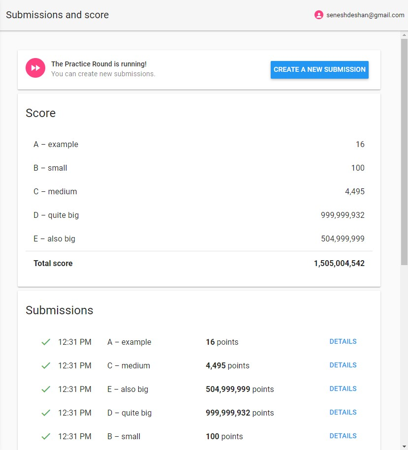

# Google Hash Code 2020 | version 2.0
[version 1.0](https://github.com/senesh-deshan/Google-Hash-Code-2020/tree/master)

[version 1.1](https://github.com/senesh-deshan/Google-Hash-Code-2020/tree/v1)

[version 2.0](https://github.com/senesh-deshan/Google-Hash-Code-2020/tree/v2)

## More Pizza 🍕
### Solution for the Practice Round of Google Hash Code 2020 - Score: 1,505,004,542


## The solution

> This code is not the perfect solution and it can be optimized and bugs fixed in the future.
This is just a simple solution with a simple logic which was written to inspire people and give them a start. There may be so many better solutions for this problem.

Before you read this you must check the [problem statement](Problem/slice.pdf) first

Simply the algorithm is about adding up the number of slices of the given Pizzas in reverse order

Example:

Input text
```
17 4
2 5 6 8
```
17 = the maximum number of Pizza slices to order

4  = the number of different types of Pizzas

Since there are 4 Pizzas the indexes of the pizzas are 0,1,2,3 respectively

An array traversal loop starts from end to the beginning and consider a one value at a time. Add it to the value of sum and compare

Initially,

| Current Index | Sum    | Solution |
| :-----------: |:------:| :-------:|
|       3       |   0    |          |

Now the value of the sum variable is 0 and the index is 3

First take the last value(index is 3) and add it to the value of sum and compares with required number of slices(17 in this case)
```
0 + 8 = 8
```
Total is 8. But 8 < 17. Therefore,
- Add current value to the sum variable
- Note down the current index
- Continue the procedure and move to the next value

| Current Index | Sum    | Solution |
| :-----------: |:------:| :-------:|
|       3       |   8    |   3      |

Add 6 and to the value of sum and compare

| Current Index | Sum    | Solution |
| :-----------: |:------:| :-------:|
|       2       |   8    |   3      |
```
8 + 6 = 14
```
Total is 14. But 14 < 17. Therefore,
- Add current value to the sum variable
- Note down the current index
- Continue the procedure and move to the next value

| Current Index | Sum    | Solution |
| :-----------: |:------:| :-------:|
|       2       |  14    |  3, 2    |

Add 5 and to the value of sum and compare

| Current Index | Sum    | Solution |
| :-----------: |:------:| :-------:|
|       1       |  14    |  3, 2    |
```
14 + 5 = 19
```
Total is 19. But 19 > 17. Therefore,
- DO NOT add current value to the sum variable
- DO NOT note down the current index
- Continue the procedure and move to the next value

| Current Index | Sum    | Solution |
| :-----------: |:------:| :-------:|
|       1       |  14    |  3, 2    |

Add 2 and to the value of sum and compare

| Current Index | Sum    | Solution |
| :-----------: |:------:| :-------:|
|       0       |  14    |  3, 2    |

```
14 + 2 = 16
```
Total is 16. But 16 < 17. Therefore,
- Add current value to the sum variable
- Note down the current index
- Continue the procedure and move to the next value

| Current Index | Sum    | Solution |
| :-----------: |:------:| :-------:|
|       0       |  16    |3, 2, 0   |

But there are no values remaining so the loop ends

By traversing through the Pizza list, the index numbers of the Pizzas that need to be order are 0, 2, 3.

So the output file should looks like,

```
3
0 2 3
```

The final solution implemented in Java can be found [here](Solution/Solution.java)

Input files can be found [here](Input/)

Output files can be found [here](Output/)


## Results


